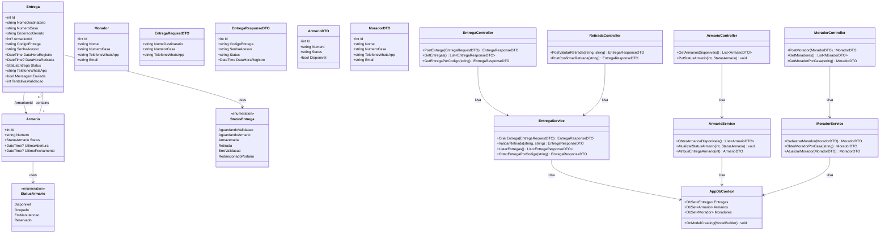

# Diagrama de Classes - Sistema de Entregas Condominiais

```mermaid
classDiagram
    %% Models
    class Entrega {
        +int Id
        +string NomeDestinatario
        +string NumeroCasa
        +string EnderecoGerado
        +int? ArmariumId
        +string CodigoEntrega
        +string SenhaAcesso
        +DateTime DataHoraRegistro
        +DateTime? DataHoraRetirada
        +StatusEntrega Status
        +string TelefoneWhatsApp
        +bool MensagemEnviada
        +int TentativasValidacao
    }
    
    class Armario {
        +int Id
        +string Numero
        +StatusArmario Status
        +DateTime? UltimaAbertura
        +DateTime? UltimoFechamento
    }
    
    class Morador {
        +int Id
        +string Nome
        +string NumeroCasa
        +string TelefoneWhatsApp
        +string Email
    }

    %% Enums
    class StatusEntrega {
        <<enumeration>>
        AguardandoValidacao
        AguardandoArmario
        Armazenada
        Retirada
        ErroValidacao
        RedirecionadoPortaria
    }
    
    class StatusArmario {
        <<enumeration>>
        Disponivel
        Ocupado
        EmManutencao
        Reservado
    }

    %% Relacionamentos entre Models
    Entrega --> Armario : ArmariumId
    Armario "1" --o "0..*" Entrega : contains
    Entrega --> StatusEntrega : uses
    Armario --> StatusArmario : uses

    %% DTOs
    class EntregaRequestDTO {
        +string NomeDestinatario
        +string NumeroCasa
        +string TelefoneWhatsApp
    }
    
    class EntregaResponseDTO {
        +int Id
        +string CodigoEntrega
        +string SenhaAcesso
        +string Status
        +DateTime DataHoraRegistro
    }
    
    class ArmarioDTO {
        +int Id
        +string Numero
        +string Status
        +bool Disponivel
    }
    
    class MoradorDTO {
        +int Id
        +string Nome
        +string NumeroCasa
        +string TelefoneWhatsApp
        +string Email
    }

    %% Services
    class EntregaService {
        +CriarEntrega(EntregaRequestDTO) EntregaResponseDTO
        +ValidarRetirada(string, string) EntregaResponseDTO
        +ListarEntregas() List~EntregaResponseDTO~
        +ObterEntregaPorCodigo(string) EntregaResponseDTO
    }
    
    class ArmarioService {
        +ObterArmariosDisponiveis() List~ArmarioDTO~
        +AtualizarStatusArmario(int, StatusArmario) void
        +AtribuirEntregaArmario(int) ArmarioDTO
    }
    
    class MoradorService {
        +CadastrarMorador(MoradorDTO) MoradorDTO
        +ObterMoradorPorCasa(string) MoradorDTO
        +AtualizarMorador(MoradorDTO) MoradorDTO
    }

    %% Controllers
    class EntregaController {
        +PostEntrega(EntregaRequestDTO) EntregaResponseDTO
        +GetEntregas() List~EntregaResponseDTO~
        +GetEntregaPorCodigo(string) EntregaResponseDTO
    }
    
    class RetiradaController {
        +PostValidarRetirada(string, string) EntregaResponseDTO
        +PostConfirmarRetirada(string) EntregaResponseDTO
    }
    
    class ArmarioController {
        +GetArmariosDisponiveis() List~ArmarioDTO~
        +PutStatusArmario(int, StatusArmario) void
    }
    
    class MoradorController {
        +PostMorador(MoradorDTO) MoradorDTO
        +GetMoradores() List~MoradorDTO~
        +GetMoradorPorCasa(string) MoradorDTO
    }

    %% Entity Framework
    class AppDbContext {
        +DbSet~Entrega~ Entregas
        +DbSet~Armario~ Armarios
        +DbSet~Morador~ Moradores
        +OnModelCreating(ModelBuilder) void
    }

    %% Relacionamentos de Dependência
    EntregaController --> EntregaService : Usa
    RetiradaController --> EntregaService : Usa
    ArmarioController --> ArmarioService : Usa
    MoradorController --> MoradorService : Usa
    
    EntregaService --> AppDbContext : Usa
    ArmarioService --> AppDbContext : Usa
    MoradorService --> AppDbContext : Usa
```
