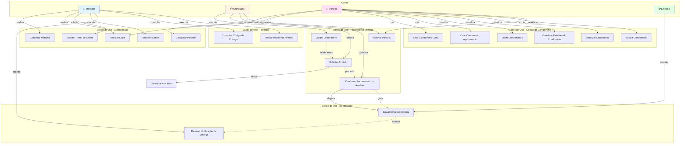

# Diagrama de Casos de Uso - PortSafe

## Diagrama Completo do Sistema

```mermaid
graph TB
    subgraph Atores
        Morador[👤 Morador]
        Entregador[📦 Entregador]
        Porteiro[🚪 Porteiro]
        Sistema[⚙️ Sistema]
    end

    subgraph "Casos de Uso - Autenticação"
        UC1[Cadastrar Morador]
        UC2[Cadastrar Porteiro]
        UC3[Realizar Login]
        UC4[Solicitar Reset de Senha]
        UC5[Redefinir Senha]
    end

    subgraph "Casos de Uso - Gestão de Condomínio"
        UC6[Criar Condomínio Casa]
        UC7[Criar Condomínio Apartamento]
        UC8[Listar Condominios]
        UC9[Visualizar Detalhes do Condominio]
        UC10[Atualizar Condominio]
        UC11[Excluir Condominio]
    end

    subgraph "Casos de Uso - Processo de Entrega"
        UC12[Validar Destinatário]
        UC13[Solicitar Armário]
        UC14[Confirmar Fechamento do Armário]
        UC15[Acionar Portaria]
    end

    subgraph "Casos de Uso - Notificações"
        UC16[Enviar Email de Entrega]
        UC17[Receber Notificação de Entrega]
    end

    subgraph "Casos de Uso - Retirada"
        UC18[Consultar Código de Entrega]
        UC19[Retirar Pacote do Armário]
    end

    %% Relacionamentos Morador
    Morador -->|realiza| UC1
    Morador -->|realiza| UC3
    Morador -->|solicita| UC4
    Morador -->|executa| UC5
    Morador -->|recebe| UC17
    Morador -->|consulta| UC18
    Morador -->|executa| UC19

    %% Relacionamentos Entregador
    Entregador -->|executa| UC12
    Entregador -->|solicita| UC13
    Entregador -->|confirma| UC14
    Entregador -->|aciona| UC15

    %% Relacionamentos Porteiro
    Porteiro -->|realiza| UC2
    Porteiro -->|realiza| UC3
    Porteiro -->|cria| UC6
    Porteiro -->|cria| UC7
    Porteiro -->|consulta| UC8
    Porteiro -->|visualiza| UC9
    Porteiro -->|atualiza| UC10
    Porteiro -->|exclui| UC11
    Porteiro -->|auxilia em| UC15

    %% Relacionamentos Sistema
    Sistema -->|executa| UC16
    UC14 -->|dispara| UC16
    UC13 -->|aloca| Armario[Gerenciar Armários]

    %% Dependências entre casos de uso
    UC12 -.->|valida antes| UC13
    UC13 -.->|precede| UC14
    UC14 -.->|gera| UC16
    UC16 -.->|notifica| UC17

    style Morador fill:#e1f5ff
    style Entregador fill:#fff4e1
    style Porteiro fill:#ffe1f5
    style Sistema fill:#e1ffe1
```
