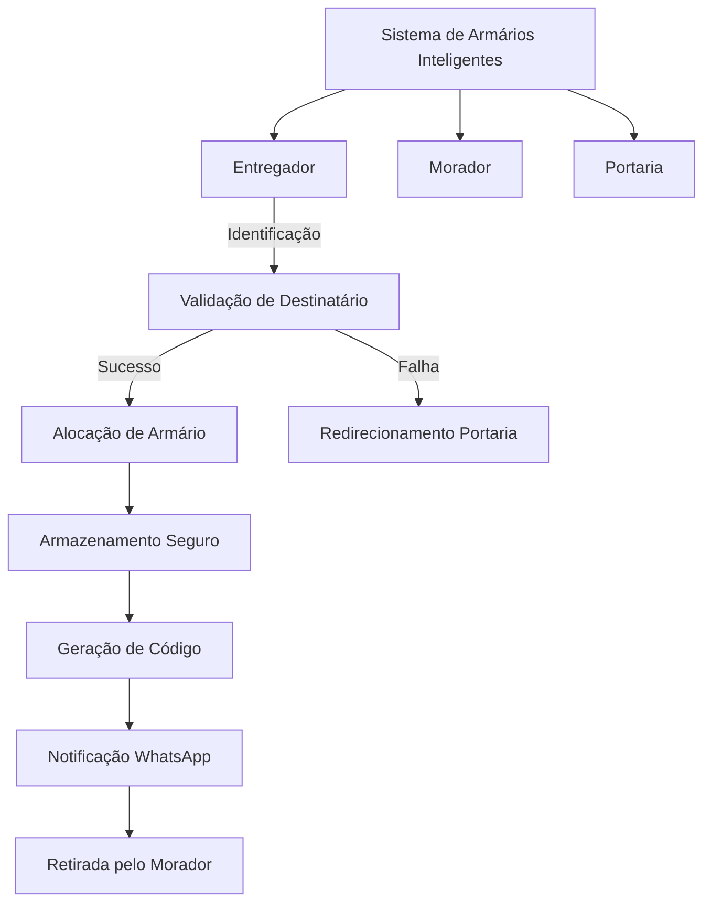

# Sprint 2 - Sistema de Armários Inteligentes para Condomínios

## Visão Geral
Esta sprint implementa o sistema de armários inteligentes PortSafe para automatizar o processo de entrega e retirada de encomendas em condomínios, proporcionando segurança, conveniência e eficiência para todas as partes envolvidas.

## Data

29/09/2025 até 03/09/2025

## Arquitetura do Sistema

## Casos de Uso

### UC-001: Registrar Entrega
**Ator Principal:** Entregador  
**Objetivo:** Registrar uma nova entrega no sistema de armários

**Pré-condições:**
- Entregador autenticado no sistema
- Pelo menos um armário disponível

**Fluxo Principal:**
1. Entregador acessa interface do sistema
2. Sistema solicita dados do destinatário (nome, número da casa)
3. Entregador insere informações da encomenda
4. Sistema valida dados contra base de moradores cadastrados
5. Sistema aloca armário disponível automaticamente
6. Sistema gera código único de retirada
7. Sistema armazena encomenda e atualiza status do armário
8. Sistema envia notificação WhatsApp para o morador
9. Sistema exibe confirmação da entrega para o entregador

**Fluxos Alternativos:**
- **3a.** Dados inválidos: Sistema solicita correção
- **4a.** Morador não encontrado: Sistema oferece opção de redirecionamento para portaria
- **5a.** Nenhum armário disponível: Sistema redireciona para portaria

**Pós-condições:**
- Entrega registrada no sistema
- Armário ocupado
- Morador notificado

### UC-002: Retirar Encomenda
**Ator Principal:** Morador  
**Objetivo:** Retirar encomenda armazenada no armário

**Pré-condições:**
- Morador possui código de retirada válido
- Encomenda está armazenada no sistema

**Fluxo Principal:**
1. Morador acessa interface no painel do armário
2. Sistema solicita código de retirada
3. Morador insere código recebido via WhatsApp
4. Sistema valida código e identifica armário correspondente
5. Sistema libera abertura do armário específico
6. Morador retira encomenda
7. Sistema registra retirada com timestamp
8. Sistema atualiza status do armário para disponível

**Fluxos Alternativos:**
- **3a.** Código inválido: Sistema exibe mensagem de erro
- **3b.** Código expirado: Sistema solicita contato com portaria

**Pós-condições:**
- Encomenda retirada
- Armário disponível para nova entrega
- Registro de retirada no histórico

### UC-003: Gerenciar Armários
**Ator Principal:** Sistema/Portaria  
**Objetivo:** Monitorar e manter o estado dos armários

**Pré-condições:**
- Sistema operacional
- Acesso administrativo

**Fluxo Principal:**
1. Sistema monitora continuamente status dos armários
2. Sistema detecta mudanças de estado (abertura/fechamento)
3. Sistema registra timestamps de todas as operações
4. Sistema identifica armários com problemas (manutenção necessária)
5. Sistema gera relatórios de utilização

**Fluxos Alternativos:**
- **4a.** Armário com defeito: Sistema marca para manutenção
- **4b.** Encomenda não retirada em 48h: Sistema notifica portaria

### UC-004: Validar Destinatário
**Ator Principal:** Sistema  
**Objetivo:** Verificar se o destinatário é morador válido do condomínio

**Pré-condições:**
- Base de dados de moradores atualizada
- Dados do destinatário informados

**Fluxo Principal:**
1. Sistema recebe nome e número da casa
2. Sistema consulta base de moradores cadastrados
3. Sistema valida correspondência exata
4. Sistema confirma morador válido
5. Sistema autoriza prosseguimento da entrega

**Fluxos Alternativos:**
- **3a.** Nome não encontrado: Sistema oferece correção ou redirecionamento
- **3b.** Número da casa não corresponde: Sistema solicita validação

### UC-005: Processar Falhas de Validação
**Ator Principal:** Sistema/Portaria  
**Objetivo:** Tratar casos onde a validação automática falha

**Pré-condições:**
- Tentativa de entrega com dados inválidos
- Sistema detectou inconsistência

**Fluxo Principal:**
1. Sistema identifica falha na validação
2. Sistema incrementa contador de tentativas
3. Sistema oferece nova tentativa de digitação
4. Se exceder limite (3 tentativas), sistema redireciona para portaria
5. Portaria recebe notificação da entrega pendente
6. Portaria processa entrega manualmente.

**Participantes:**
1. Pedro Dias : Estruturou o novo fluxo do projeto.
2. Maria Eduarda : Criou o Board do projeto.
3. Milenna Portella : Criou as tasks no board.
4. Juliana Nascimento : Fez o prototipo do frontend no figma.